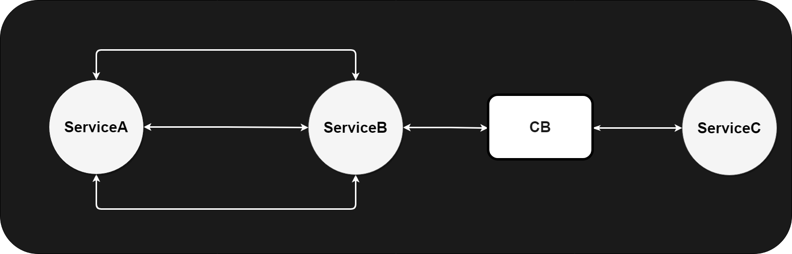

# Circuit Breaker and Retry using Resilience4J

This project is a demo of CircuitBreaker and Retry Mechanism using Resilience4J library and Spring Boot.

## Design


This project implements 3 modules:
* *ServiceA* consists on a set of bash scripts that will execute both synchronous and asynchronous calls to service B.
* *ServiceB* receives requests and call the respective endpoint in service, while implementing the CircuitBreaker and Retry Pattern.
* *ServiceC* service that will represent the faulty “external service”.

## Additional details
### Dependencies
ServiceB will implement the circuit breaker and retry patterns for it the following dependencies are added to the [pom of the service B maven project](ServiceB/pom.xml).

````
<dependency>
    <groupId>org.springframework.cloud</groupId>
    <artifactId>spring-cloud-starter-circuitbreaker-resilience4j</artifactId>
</dependency>

<dependency>
    <groupId>org.springframework.boot</groupId>
    <artifactId>spring-boot-starter-aop</artifactId>
</dependency>
````


### Expose Circuit Breaker metrics on actuator endpoints

It is possible to expose the circuit breaker metrics on the actuator endpoints.
For this is necessary to enable them on the [actuator configuration](ServiceB/src/main/resources/application.yaml) as seen in the example bellow. 


````
management:
  health:
    circuitbreakers:
      enabled: true
  endpoints:
    web:
      exposure:
        include: *
  endpoint:
    health:
      show-details: always
````

After this the metrics will be exposes in the actuator/health endpoint.

Additionally, other useful endpoints are also exposed (some of the most relevant):
````
actuator/circuitbreakers
actuator/circuitbreakers/{name}
actuator/circuitbreakerevents

actuator/retries
actuator/retriesevents
````

### Method annotations

To enable the CircuitBreaker and Retry the following annotation must be added to the method where CircuitBreaker pattern must be implemented.

#### CircuitBreaker Pattern annotation
````
@CircuitBreaker(name = CIRCUIT_BREAKER_NAME, fallbackMethod = CIRCUIT_BREAKER_FALLBACK)
````
Where:
* CIRCUIT_BREAKER_NAME, must be the exact same string used on circuit breaker configuration in the service application properties.
* CIRCUIT_BREAKER_FALLBACK (optional), must be the exact name of the method that will implement the fallback function for this CB.

NOTE: The fallback must follow the same method signature than the one where the circuit breaker annotation is added.
This means that should return the exact same object type and expect to receive the same parameter number and types, additionally is allowed to be added a parameter to the method signature for the Exception sent from the CB execution.

The CircuitBreaker annotations are implemented in the [CircuitBreakerController](ServiceB/src/main/java/org/tf/training/circuitbreaker/serviceb/controller/CircuitBreakerController.java).

#### Retry Pattern annotation
The retry pattern annotation follows the same guidelines mentioned before.

````
@Retry(name = RETRY_NAME, fallbackMethod = RETRY_FALLBACK)
````
The Retry annotations are implemented in the [RetryMechanismController](ServiceB/src/main/java/org/tf/training/circuitbreaker/serviceb/controller/RetryMechanismController.java).

### Configure CircuitBreaker and Retry

Finally, is necessary to add the CircuitBreaker and Retry configurations to the [application properties file](ServiceB/src/main/resources/application.yaml).
Full properties description can be found in the [resilience4J documentation](https://resilience4j.readme.io/docs/circuitbreaker).

````
resilience4j:
  circuitbreaker:
    instances:
      serviceC:
        registerHealthIndicator: true
        slidingWindowSize: 10
        slidingWindowType: COUNT_BASED
        waitDurationInOpenState: 5s
        failureRateThreshold: 50
        permittedNumberOfCallsInHalfOpenState: 3
        automaticTransitionFromOpenToHalfOpenEnabled: true
        failure-rate-threshold: 60
        slow-call-duration-threshold: 30s
        slow-call-rate-threshold: 60
  retry:
    instances:
      serviceC:
        maxAttempts: 5
        waitDuration : 1s
        enable-exponential-backoff: true
        exponential-backoff-multiplier: 2
````

### CircuitBreaker and Retry simultaneously

it is possible to have both retry and circuit breaker applied int the same method. However, some changes are required to the default configuration.

By default, circuit breaker always takes preference related to the retry mechanism. So if we want to have the system to first retry and then enter the circuit breaker with the fallback mechanism. Is necessary to change the aspect order of the patterns.

````
circuitbreaker:
    circuitBreakerAspectOrder: 2
retry:
    retryAspectOrder: 5
````    

The higher the value the higher the priority.

## References:
* [CircuitBreaker - Context and Problem](https://learn.microsoft.com/en-us/azure/architecture/patterns/circuit-breaker)
* [Retry Pattern - Context and Problem](https://learn.microsoft.com/en-us/azure/architecture/patterns/retry)
* [Resilience4J - CircuitBreaker documentation](https://resilience4j.readme.io/docs/circuitbreaker)
* [Resilience4J - Retry documentation](https://resilience4j.readme.io/docs/retry)